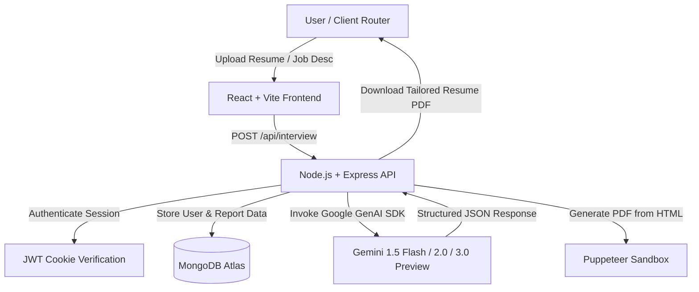

# 🎯 PrepIQ (AI-Powered Interview Strategy & Resume Builder)

PrepIQ is a premium, full-stack, AI-powered interview preparation and resume enhancement platform. By utilizing the cutting-edge capabilities of **Google Gemini**, PrepIQ analyzes a user's resume and target job description to generate highly customized, actionable preparation guides, technical and behavioral interview questionnaires, skill gap analyses, and ATS-friendly, professional resumes exported directly to PDF.

---

## 🛠️ Architecture & Working Principle

PrepIQ operates on a classic, robust client-server-database architecture paired with an AI-orchestration pipeline:



### 1. The Core Engines

*   **Frontend (UI/UX)**: Built using **React** and **Vite** with **Sass/SCSS** for styling. It uses component-based state management, React Context for user authentication, and responsive, interactive visual panels for comparing resumes and job profiles.
*   **Backend (REST API)**: Powered by **Node.js** and **Express.js**. It exposes secure REST endpoints for user authentication (JWT via HttpOnly Cookies), interview report lifecycle management, and resume PDF generation.
*   **Database (Mongoose/MongoDB Atlas)**: Stores user credentials (salted & hashed via `bcryptjs`), raw session schemas, and historical interview strategy reports.
*   **AI Service (Google GenAI)**: Integrates the new `@google/genai` library to interface with Google's state-of-the-art models. It utilizes structured output generation via Zod schemas to ensure highly reliable JSON outputs.
*   **PDF Compiler (Puppeteer)**: Renders AI-generated, custom-designed HTML code directly inside a headless Chrome instance and compiles it to standard A4 PDF files.

---

## 📂 Project Directory Structure

```text
gen-ai-full-stack-project/
├── backend/
│   ├── src/
│   │   ├── config/             # Configuration files (Database connections)
│   │   ├── controllers/        # Route controllers (Auth, Interview strategies)
│   │   ├── middlewares/        # Express middleware (Auth protection, validation)
│   │   ├── models/             # Mongoose schemas (User, InterviewReport, Blacklist)
│   │   ├── routes/             # REST route mapping
│   │   └── sevices/            # External services (Google GenAI, Puppeteer PDF compiler)
│   ├── server.js               # Application entry point
│   ├── package.json            # Node backend dependencies
│   └── .env.example            # Environment configurations reference
│
├── frontend/
│   ├── src/
│   │   ├── features/
│   │   │   ├── auth/           # Login, Registration, JWT State, and Core UI Pages
│   │   │   └── interview/      # Dashboards, Strategy Creator, API handlers
│   │   ├── styles/             # Application-wide styling variables & animations
│   │   ├── App.jsx             # Root layout and context wrapper
│   │   ├── app.routes.jsx      # Client-side router definition
│   │   └── main.jsx            # React root mount
│   ├── index.html              # Core HTML structure
│   ├── vite.config.js          # Vite building config
│   ├── package.json            # Frontend JS dependencies
│   └── .env.example            # Client API target settings
```

---

## ⚡ Key Features

*   **🔑 Multi-Session Authentication**: Built-in Register, Login, and Logout features protected by signed, HttpOnly cookies containing JSON Web Tokens (JWT).
*   **📊 Resume-Job Description Match Score**: Prompt-engineered metrics calculated dynamically on the differences between your experience and target job profiles.
*   **💡 Tailored Interview Q&A**:
    *   **Technical Module**: Generates 5+ targeted questions testing technical competency, highlighting the interviewer's exact intentions, and providing ideal responses.
    *   **Behavioral Module**: Compiles questions focusing on leadership, conflict resolution, and situational responses.
*   **🧩 Strategic Skill-Gap Analysis**: Lists exact missing skills, classified by high, medium, and low severity.
*   **📅 Dynamic Day-by-Day Preparation Plan**: Provides a comprehensive roadmap outlining daily tasks, concepts to read, and practical challenges to build.
*   **📄 AI-Tailored PDF Resume Generation**: Rewrites and formats the resume into an ATS-friendly, clean HTML layout, which is compiled and served as a downloadable PDF using Puppeteer.

---

## 🔌 API Endpoints & Interfaces

### 1. Authentication
*   `POST /api/auth/register` — Creates a new developer account.
*   `POST /api/auth/login` — Verifies credentials and issues a secure JWT cookie.
*   `GET /api/auth/logout` — Destroys the cookie and blacklists the current JWT.
*   `GET /api/auth/get-me` — Returns details of the logged-in user profile.

### 2. Interview Plans & PDF
*   `POST /api/interview/` — Accepts a PDF resume file and form descriptions to compile a complete strategy report.
*   `GET /api/interview/:interviewId` — Fetches a saved report's details.
*   `GET /api/interview/` — Retrieves a list of all historical strategy plans created by the logged-in user.
*   `DELETE /api/interview/:interviewId` — Deletes a report.
*   `POST /api/interview/resume/pdf/:interviewId` — Compiles and returns a downloadable customized resume PDF based on the job description.

---

## 🚀 Setup & Installation

### Prerequisites
*   Node.js (v18 or higher)
*   MongoDB Atlas cluster or local database instance
*   Google Gemini API Key

### 1. Clone & Install Dependencies
First, install the package files inside both directories:
```bash
# Clone the repository
git clone https://github.com/your-username/PrepIQ.git
cd PrepIQ

# Setup Backend dependencies
cd backend
npm install

# Setup Frontend dependencies
cd ../frontend
npm install
```

### 2. Configure Environment Variables
Create `.env` files in both directories as shown in `.env.example`:

*   **Backend (`backend/.env`):**
    ```env
    MONGO_URI="your_mongodb_connection_string"
    JWT_SECRET="generate_a_random_jwt_secret"
    GOOGLE_GENAI_API_KEY="your_gemini_api_key"
    FRONTEND_URL="http://localhost:5173"
    PORT=3000
    ```

*   **Frontend (`frontend/.env`):**
    ```env
    VITE_API_URL="http://localhost:3000"
    ```

### 3. Run Locally

*   **Run Backend Server:**
    ```bash
    cd backend
    npm run dev
    ```
*   **Run Frontend Client:**
    ```bash
    cd frontend
    npm run dev
    ```
*   Open `http://localhost:5173` in your browser.

---

## 🎯 Production Deployment

### Backend (Render / Railway / Heroku)
1. Set the root directory to `backend`.
2. Set Build Command: `npm install`
3. Set Start Command: `npm start`
4. Set Environment variables matching `backend/.env`.
5. *Note: Ensure your cloud provider has support for Puppeteer (headless Chrome libraries/packages).*

### Frontend (Vercel / Netlify)
1. Set the root directory to `frontend`.
2. Add environment variable `VITE_API_URL` pointing to your deployed backend URL.
3. Build command: `npm run build`
4. Output directory: `dist`
